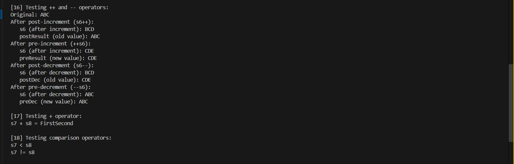

## Summary Table
| Feature       | Details                                |
|---------------|----------------------------------------|
| Language      | C++                                    |
| Platform      | Linux, macOS, Windows                  |
| Compiler      | g++ (C++17 recommended)                |
| License       | MIT                                    |
| Author        | Muneeb Hussain                         |


# 📘 MyString-OOP-Project

A C++ implementation of a **custom string class** (`MyString`) that mimics and extends the functionality of `std::string`.  
This project demonstrates **core Object-Oriented Programming (OOP) concepts** such as encapsulation, abstraction, operator overloading, function overloading, file handling, modularity, and dynamic memory management.  

---

## 📂 Project Structure

MyString-OOP-Project/
│
│── docs/                  # Documentation
│   ├── MyString_Project_Documentation.docx
│   └── MyString_Project_Documentation.pdf
│
│── src/                   # Source code
│   ├── main.cpp
│   ├── MyString.cpp
│   └── MyString.h
│
│── output/                # Screenshots of program output
│   ├── Output1_BasicConstructors.PNG
│   ├── Output2_StringOperations.PNG
│   ├── Output3_OperatorOverloading.PNG
│   ├── Output4_FileHandling.PNG
│   └── Output5_FinalExecution.PNG
│
│── media/                 # Project demo videos
│   ├── 01_Code_Walkthrough.mp4
│   └── 02_Execution_Demo.mp4
│
│── README.md              # Main project overview

---

## ✨ Features

- **Dynamic memory management** using `new`/`delete`.  
- **Operator overloading** (`=`, `+`, `++`, `--`, `==`, etc.).  
- **Function overloading** (multiple constructors).  
- **Encapsulation & abstraction** (private data, public methods).  
- **File handling** with custom objects (save & read strings).  
- **Modularity** (`.h`, `.cpp`, and `main.cpp`).  
- **Static members** to track object counts.  
- **String operations**: append, slicing, insert, erase, compare, case conversion.  
- **Character operations**: pushBack, popBack, front, back.  

---

## 🖥️ Sample Outputs

Some example screenshots of execution:  

**Figure 1: Basic Constructors**  
  

**Figure 2: String Operations (append, slicing, insert)**  
  

**Figure 3: Operator Overloading**  
  

**Figure 4: File Handling Demonstration**  
  

**Figure 5: Final Execution**  
  

(See all screenshots in the `output/` folder.)

---

## 🎥 Demo Videos

- [📺 Code Walkthrough (Download)](media/01_Code_Walkthrough.mp4)  
- [▶ Execution Demo (Download)](media/02_Execution_Demo.mp4)  

---

## 📄 Documentation

- [📄 Word Documentation (Download)](docs/MyString_Project_Documentation.docx)  
- [📕 PDF Documentation (Download)](docs/MyString_Project_Documentation.pdf)  


---

## ⚙️ How to Run
1. Clone this repository:
   ```bash
   git clone https://github.com/Muneeb-techpro/MyString-OOP-Project.git
   cd MyString-OOP-Project
   ```
2. Compile the program:
    - Make sure you have g++ installed (MinGW or MSYS2) on Windows.

    ```bash
    g++ src/main.cpp src/MyString.cpp -o mystring_app
    ```

3. Run the executable:
    - On Linux / macOS:
        ```bash
        ./mystring_app
        ```
    - On Windows (MinGW or MSYS2):
        ```bash
        mystring_app.exe
        ```


---

## Future Enhancements

- Implement move constructor & move assignment for efficiency.
- Add exception handling for invalid inputs.
- Extend operator overloading for lexicographical comparison.
- Optimize memory allocation for large strings.

---

## 📜 License

This project is licensed under the MIT License.
It is intended to be used only for positive and productive purposes such as learning, research, and development.


---

## 👨‍💻 Author
Muneeb Hussain
Bachelor of Computer Science, UCP
